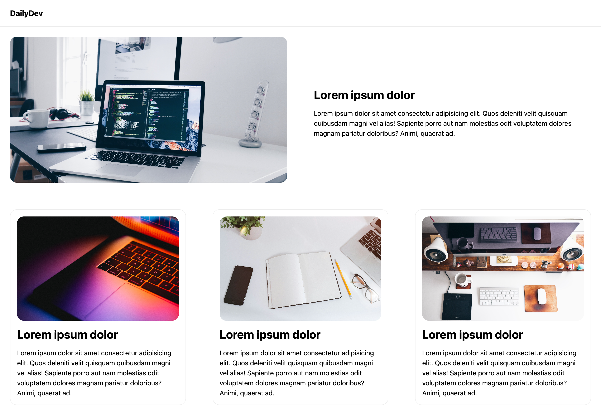

## Multi-Column Layout

A multi-column layout is a design technique to display content in multiple columns withing a single page. 

Instead of traditional single column layout where content flows from top to bottom. A multi-column layout allows content to flow into multiple columns vertical columns within the same space.

We can use the CSS `display: grid` and `grid-template-columns` properties to achieve this.

Multi-column layout are essential for text heavy content such as articles, where breaking content in columns can improve readiblity and utilise space more efficiently.

